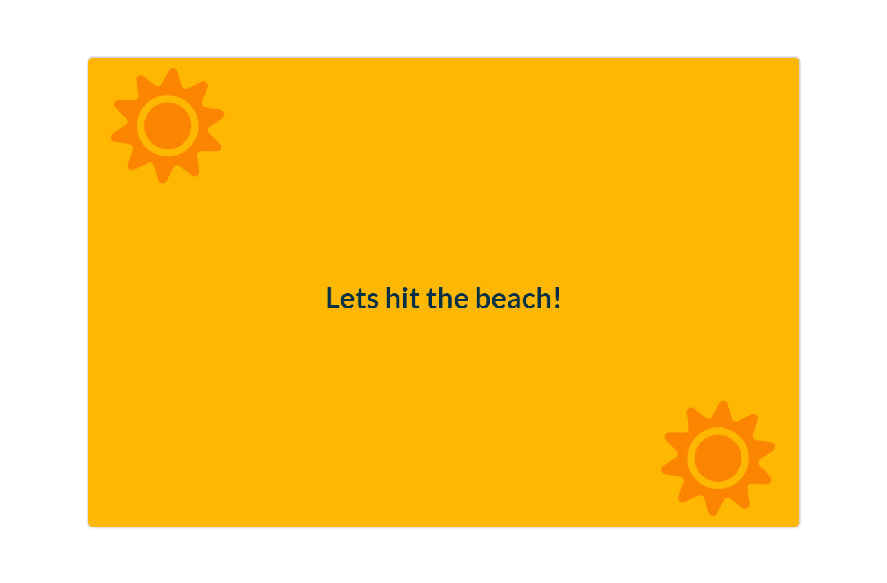

# The season project.

-Show winter or summer season, depends on location.

_Using:_

[Geolocation API](https://developer.mozilla.org/en-US/docs/Web/API/Geolocation_API)\
[Geolocation.getCurrentPosition()](https://developer.mozilla.org/en-US/docs/Web/API/Geolocation/getCurrentPosition)

