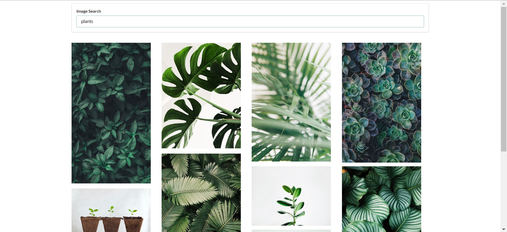

# Image search project

-Get a search term from the user.\
-Use that search term to make a request to an outside API and fetch data.\
-Take the fetched images and show them on the screen in a table.

_Using:_\
[Unsplash API](https://unsplash.com/developers)\
[axios](https://www.npmjs.com/package/axios)

```
create-react-app search
npm install --save axios
npm start
```


